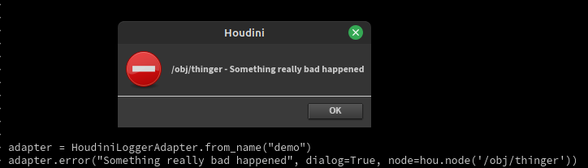
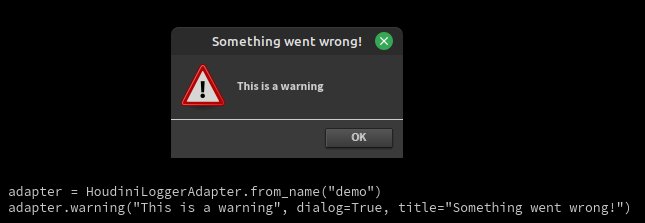
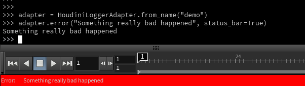

====================
HoudiniLoggerAdapter
====================

The :class:`~houdini_logging_tools.adapters.loggeradapter.HoudiniLoggerAdapter` is a :class:`logging.LoggerAdapter`
that provides a number of conveniences for Houdini.

The adapter can be instantiated directly while passing in an existing instance of :class:`logging.Logger` or by using
the :meth:`~houdini_logging_tools.adapters.loggeradapter.HoudiniLoggerAdapter.from_name` class method that will create
a logger of the supplied name and then instantiating the adapter using it.

The following two are equivalent:

.. code-block:: python

    >>> logger = logging.getLogger("demo")
    >>> adapter = HoudiniLoggerAdapter(logger)

.. code-block:: python

    >>> adapter = HoudiniLoggerAdapter.from_name("demo")

The adapter specific keywords available at adapter creation time (direct object instantiation or using ) or
at log emission time.

Node Path Output
----------------

The main feature of :class:`~houdini_logging_tools.adapters.loggeradapter.HoudiniLoggerAdapter` is the ability to
specify a node which is associated with the message.  This allows you to do things such as make log calls from inside
**Python** nodes that are cooking and have their path included as part of the message so that you're able to see the
source of messages.

.. code-block:: python

    >>> adapter = HoudiniLoggerAdapter.from_name("demo")
    >>> adapter.warning("This is a warning")
    This is a warning
    >>> adapter.warning("This is a warning", node=hou.node('/obj/geo1'))
    /obj/geo1 - This is a warning

Here we can see that by passing a :class:`hou.Node` as the **node** kwarg we get the log message containing that node's
path.

Houdini UI Output
-----------------

Severity Mapping
^^^^^^^^^^^^^^^^

When outputting to Houdini UI tooling the log message severity is automatically remapped to the most appropriate
:mod:`hou.severityType` value:

.. list-table::
    :header-rows: 1

    * - Log Severity
      - Houdini Severity
    * - critical
      - hou.severityType.Error
    * - debug
      - hou.severityType.Message
    * - error
      - hou.severityType.Error
    * - exception
      - hou.severityType.Error
    * - info
      - hou.severityType.ImportantMessage
    * - warning
      - hou.severityType.Warning

Message Dialogs
^^^^^^^^^^^^^^^

By utilizing the **dialog** kwarg we can cause the log message to also be emitted as a Houdini dialog via
:func:`hou.ui.displayMessage`.

.. code-block:: python

    >>> adapter = HoudiniLoggerAdapter.from_name("demo")
    >>> adapter.error("Something really bad happened", dialog=True, node=hou.node('/obj/thinger'))
    /obj/thinger - Something really bad happened

Custom Dialog Titles
""""""""""""""""""""

A **title** kwarg is also respected when **dialog=True** such that the generated message popup will use the supplied
title instead of the default.

.. code-block:: python

    >>> adapter = HoudiniLoggerAdapter.from_name("demo")
    >>> adapter.warning("This is a warning", dialog=True, title="Something went wrong!")
    This is a warning

Status Bar Messages
^^^^^^^^^^^^^^^^^^^

By utilizing the **status_bar** kwarg we can cause the log message to also be emitted as a Houdini status bar message
via :func:`hou.ui.setStatusMessage`.

.. code-block:: python

    >>> adapter = HoudiniLoggerAdapter.from_name("demo")
    >>> adapter.error("Something really bad happened", status_bar=True)
    Something really bad happened

Standard log call arg support
-----------------------------

The adapter also supports any expected extra args being passed to log calls, such as using format strings:

.. code-block:: python

    >>> adapter = HoudiniLoggerAdapter.from_name("demo")
    >>> adapter.warning("This is a %s", "test", node=hou.node('/obj/geo1'))
    /obj/geo1 - This is a test

