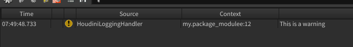

=====================
HoudiniLoggingHandler
=====================

The :class:`~houdini_logging_tools.handlers.houdini_logging.HoudiniLoggingHandler` handler class is a
:class:`logging.StreamHandler` that will output log messages to Houdini's logging system.

