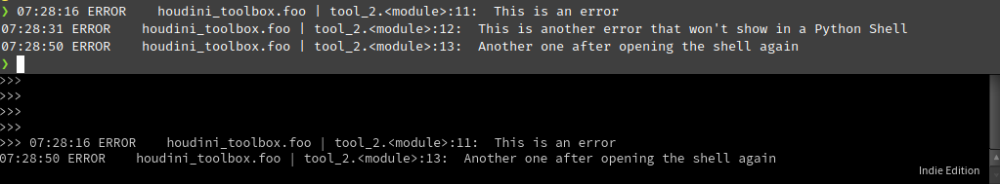

==================
PythonShellHandler
==================

The :class:`~houdini_logging_tools.handlers.shellio.PythonShellHandler` handler class is a :class:`logging.StreamHandler` that will output log
messages to a Houdini Python Shell pane tab if one is displayed.

This handler works by checking that :data:`sys.stdout` is pointing to an instance of :class:`hou.ShellIO`. If that check
is true then there is a displayed Python Shell pane tab to output the log message to.  If the check fails there is not
an active pane tab and the handler will not output a message.

Consider the following example using a log call from a shelf tool where the top half is the system terminal from which
Houdini was launched form and the bottom half is a Python Shell parameter pane docked in the desktop.

On the top half we can see three log outputs as the logger is always outputting to a standard stream handler
back to the originating shell.

On the bottom we can see that it is missing the second one. This is because the Python Shell tab was open for the first
call, hidden for the second call, then displayed again for the first call.

